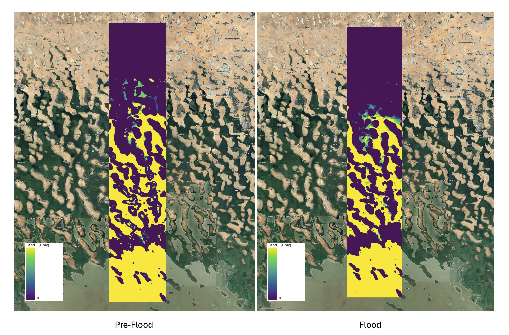

<!-- PROJECT SHIELDS -->

[![Contributors][contributors-shield]][contributors-url]
[![Forks][forks-shield]][forks-url]
[![Stargazers][stars-shield]][stars-url]
[![Issues][issues-shield]][issues-url]
[![MIT License][license-shield]][license-url]
[![LinkedIn][linkedin-shield]][linkedin-url]

 

 

# RWD Raster Builder

The RWD Raster Builder, builds a raster dataset using the Digital Earth Africa (DEA) Toolkit based on Sentinel-1 analysis-ready radar backscatter data. Sentinel-1, operated by the ESA as part of the Copernicus Program provides these observatiosns every 6-12 days over Africa. This gives near real-time data for accurate field analysis and estimation. 

The DEA Toolkit also has ready-to-work workflows of complex real-world problems that can be cutomized to requirements. More on this can be found on the [Read World Examples](https://docs.digitalearthafrica.org/en/latest/sandbox/notebooks/Real_world_examples/index.html) page. A major part of the [flood-mosaic](/flood-mosaic.ipynb) Jupyter Notebook was developed using the [Water Detection With Sentinel-1](https://docs.digitalearthafrica.org/en/latest/sandbox/notebooks/Real_world_examples/Radar_water_detection.html), which is one of the real world examples in the DEA Toolkit.

The Jupyter Notebooks in this repository run in the [DEA Analysis Sandbox](https://docs.digitalearthafrica.org/en/latest/sandbox/index.html).

<!-- TABLE OF CONTENTS -->

  
Table of Contents

  <ol>
    <li><a href="#prerequisites">Prerequisites</a></li>
    <li><a href="#contributors">Contributors</a></li>
    <li><a href="#license">License</a></li>
    <li><a href="#contact">Contact</a></li>
    <li><a href="#references">References</a></li>
  </ol>

## Prerequisites

The DEA Analysis Sandbox runs on the DEA server, which is an AWS EC2 instance. In order to access the Sandbox, create an account by following the instructions on the [Getting Started Page](https://docs.digitalearthafrica.org/en/latest/sandbox/access.html)

Naigate to the [Login](https://docs.digitalearthafrica.org/en/latest/sandbox/access.html) page, once the account has been created.

After logging in, choose the default environment with 2 Cores and 16 GB RAM. If for some reason this environment is slow, a later switch to the large environment is possible as well, without any loss of data. Hit "Start" and the server should begin starting up.

## Contributors:

<!-- LICENSE -->
## License

Distributed under the MIT License. See `LICENSE.txt` for more information.

<!-- CONTACT -->
## Contact

Joel Rhine: [Email](mailto:joelrhine7@gmail.com)
Website Link: [Joel Rhine | Home](https://joelrhine.tech)

<!-- REFERENCES -->
## References

* [Img Shields](https://shields.io)

[(back to top)](#rwd-raster-builder)

<!-- MARKDOWN LINKS & IMAGES -->
<!-- https://www.markdownguide.org/basic-syntax/#reference-style-links -->
[contributors-shield]: https://img.shields.io/github/contributors/rhinejoel/rwd-raster-builder.svg?style=for-the-badge
[contributors-url]: https://github.com/rhinejoel/rwd-raster-builder/graphs/contributors
[forks-shield]: https://img.shields.io/github/forks/rhinejoel/rwd-raster-builder.svg?style=for-the-badge
[forks-url]: https://github.com/rhinejoel/rwd-raster-builder/network/members
[stars-shield]: https://img.shields.io/github/stars/rhinejoel/rwd-raster-builder.svg?style=for-the-badge
[stars-url]: https://github.com/rhinejoel/rwd-raster-builder/stargazers
[issues-shield]: https://img.shields.io/github/issues/rhinejoel/rwd-raster-builder.svg?style=for-the-badge
[issues-url]: https://github.com/rhinejoel/rwd-raster-builder/issues
[license-shield]: https://img.shields.io/github/license/rhinejoel/rwd-raster-builder.svg?style=for-the-badge
[license-url]: https://github.com/rhinejoel/rwd-raster-builder/blob/master/LICENSE.txt
[linkedin-shield]: https://img.shields.io/badge/-LinkedIn-black.svg?style=for-the-badge&logo=linkedin&colorB=555
[linkedin-url]: https://linkedin.com/in/joel-rhine

[Figma]: https://img.shields.io/badge/figma-D93BDB?style=for-the-badge&logo=figma&logoColor=white
[Figma-url]: https://www.figma.com
[HTML]: https://img.shields.io/badge/html5-DE6952?style=for-the-badge&logo=html5&logoColor=white
[HTML-url]: https://developer.mozilla.org/en-US/docs/Web/HTML
[CSS]: https://img.shields.io/badge/css3-4E6CF5?style=for-the-badge&logo=css3&logoColor=4FC08D
[CSS-url]: https://developer.mozilla.org/en-US/docs/Web/CSS
[JavaScript]: https://img.shields.io/badge/JavaScript-000000?style=for-the-badge&logo=javascript&logoColor=61DAFB
[JavaScript-url]: https://developer.mozilla.org/en-US/docs/Web/JavaScript
[Hostinger]: https://img.shields.io/badge/hostinger-232267?style=for-the-badge&logo=hostinger&logoColor=61DAFB
[Hostinger-url]: https://developer.mozilla.org/en-US/docs/Web/JavaScript
