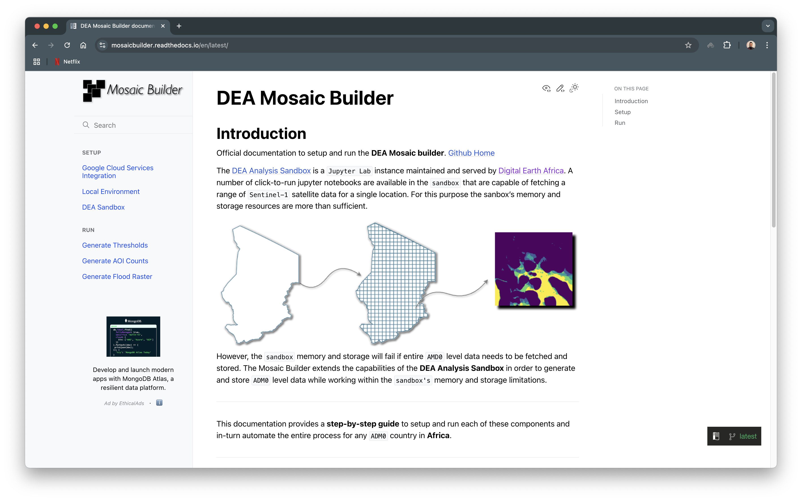
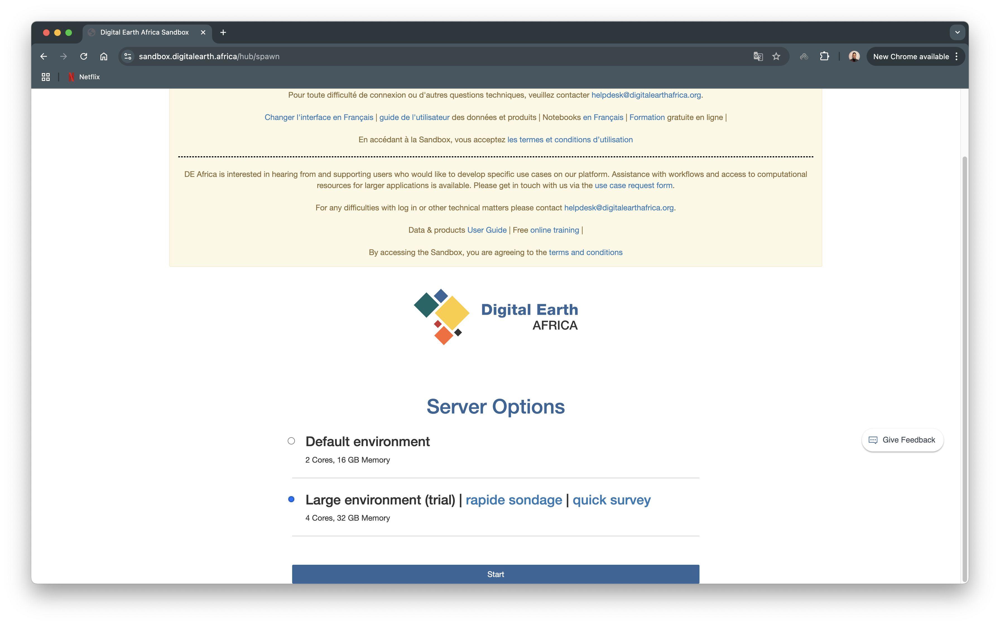
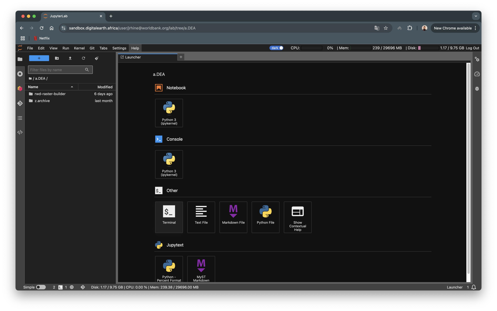

<!-- PROJECT SHIELDS -->
<div align="center" id="readme-top">

[![Contributors][contributors-shield]][contributors-url]
![GitHub Actions Workflow Status][build-url]
![Lint Workflow Status][lint-url]
![Docs Status][docs-url]
[![Forks][forks-shield]][forks-url]
[![Stargazers][stars-shield]][stars-url]
[![Issues][issues-shield]][issues-url]
[![MIT License][license-shield]][license-url]
[![LinkedIn][linkedin-shield]][linkedin-url]

</div>

<!-- MARKDOWN LINKS & IMAGES -->
<!-- https://www.markdownguide.org/basic-syntax/#reference-style-links -->

[contributors-shield]: https://img.shields.io/github/contributors/rhinejoel/rwd-raster-builder.svg?style=flat-squared?style=flat-squared
[build-url]: https://img.shields.io/github/actions/workflow/status/rhinejoel/dea-mosaic-builder/conda.yml?style=flat-squared&logo=anaconda&label=CI&logoColor=white
[lint-url]: https://img.shields.io/github/actions/workflow/status/rhinejoel/dea-mosaic-builder/black.yml?style=flat-squared&logo=task&label=lint&logoColor=white
[docs-url]: https://img.shields.io/readthedocs/mosaicbuilder?logo=readthedocs&logoColor=white
[contributors-url]: https://github.com/rhinejoel/rwd-raster-builder/graphs/contributors
[forks-shield]: https://img.shields.io/github/forks/rhinejoel/rwd-raster-builder.svg?style=flat-squared
[forks-url]: https://github.com/rhinejoel/rwd-raster-builder/network/members
[stars-shield]: https://img.shields.io/github/stars/rhinejoel/rwd-raster-builder.svg?style=flat-squared
[stars-url]: https://github.com/rhinejoel/rwd-raster-builder/stargazers
[issues-shield]: https://img.shields.io/github/issues/rhinejoel/rwd-raster-builder.svg?style=flat-squared
[issues-url]: https://github.com/rhinejoel/rwd-raster-builder/issues
[license-shield]: https://img.shields.io/github/license/rhinejoel/rwd-raster-builder.svg?style=flat-squared
[license-url]: https://github.com/rhinejoel/rwd-raster-builder/blob/master/LICENSE.txt
[linkedin-shield]: https://img.shields.io/badge/-LinkedIn-black.svg?style=flat-squared&logo=linkedin&colorB=555
[linkedin-url]: https://linkedin.com/in/joel-rhine


<br />
<div align="center">
  <picture>
  <source media="(prefers-color-scheme: dark)" srcset="docs/source/_static/rwd-header-dark.png">
  <source media="(prefers-color-scheme: light)" srcset="docs/source/_static/rwd-header-light.png">
  
</picture>
</div>
<br />


<div align=justify>

# DEA Mosaic Builder

The DEA Mosaic Builder, builds a raster dataset using the Digital Earth Africa (DEA) Toolkit based on Sentinel-1 analysis-ready radar backscatter data. Sentinel-1, operated by the ESA as part of the Copernicus Program provides these observatiosns every 6-12 days over Africa. This gives near real-time data for accurate field analysis and estimation.

The DEA Toolkit also has ready-to-work workflows of complex real-world problems that can be cutomized to requirements. More on this can be found on the [Read World Examples](https://docs.digitalearthafrica.org/en/latest/sandbox/notebooks/Real_world_examples/index.html) page. A major part of the [flood-mosaic](/flood-mosaic.ipynb) Jupyter Notebook was developed using the [Water Detection With Sentinel-1](https://docs.digitalearthafrica.org/en/latest/sandbox/notebooks/Real_world_examples/Radar_water_detection.html), which is one of the real world examples in the DEA Toolkit.

<br />

> The Jupyter Notebooks in this repository run in the [DEA Analysis Sandbox](https://sandbox.digitalearth.africa/).

<br />

</div>

## Documentation for DEA Mosaic Builder

You will find complete **readthedocs** documentation for setting up and running your project along with the quicksetup at [DEA Mosaic Builder Docs](https://mosaicbuilder.readthedocs.io).

<div align=center>
<a href="https://mosaicbuilder.readthedocs.io">

</a>
</div>

## Quicksetup

Create a Digital Earth Africa account and login using the [Login](https://sandbox.digitalearth.africa/hub/login) page.

<div align=center>

</div>

Choose one from the default or large environment and click **Start**

Once the server is ready, open the Jypyter `terminal` and clone this repository using

<div align=center>

</div>

```
git clone https://github.com/rhinejoel/dea-mosaic-builder.git

cd dea-mosaic-builder
```

Your directory should now have a new folder **dea-mosaic-builder**. The second command moves the terminal within the **dea-mosaic-builder** folder.

> Further detailed documentation available at [DEA Mosaic Builder Docs](https://mosaicbuilder.readthedocs.io)

<br />
<!-- CONTRIBUTORS -->

## Contributors

<a href="https://github.com/rhinejoel/rwd-raster-builder/graphs/contributors">
  
</a>
<br />

<!-- LICENSE -->

## License

Distributed under the MIT License. See `LICENSE.txt` for more information.
<br />

<!-- CONTACT -->

## Contact

[Email](mailto:joelrhine7@gmail.com)
Website: [Joel Rhine | Home](https://joelrhine.tech)
<br />

<!-- REFERENCES -->

## References

- [Digital Earth Africa](https://www.digitalearthafrica.org/)
- [DEA Analysis Sandbox](https://docs.digitalearthafrica.org/en/latest/sandbox/index.html)
- [G-Drive API - Python Quickstart](https://developers.google.com/drive/api/quickstart/python)
- [G-Drive API - API Reference](https://developers.google.com/drive/api/reference/rest/v3/about)
- [G-Drive API - Upload File Data](https://developers.google.com/drive/api/guides/manage-uploads#python_1)
- [G-Drive API - Media Upload](https://github.com/googleapis/google-api-python-client/blob/main/docs/media.md)

<div align="right">

[(back to top &#8593;)](#readme-top)

</div>
