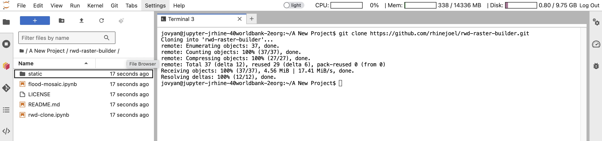

<!-- PROJECT SHIELDS -->

[![Contributors][contributors-shield]][contributors-url]
[![Forks][forks-shield]][forks-url]
[![Stargazers][stars-shield]][stars-url]
[![Issues][issues-shield]][issues-url]
[![MIT License][license-shield]][license-url]
[![LinkedIn][linkedin-shield]][linkedin-url]

 
 

  

 
 

# RWD Raster Builder

The RWD Raster Builder, builds a raster dataset using the Digital Earth Africa (DEA) Toolkit based on Sentinel-1 analysis-ready radar backscatter data. Sentinel-1, operated by the ESA as part of the Copernicus Program provides these observatiosns every 6-12 days over Africa. This gives near real-time data for accurate field analysis and estimation. 

The DEA Toolkit also has ready-to-work workflows of complex real-world problems that can be cutomized to requirements. More on this can be found on the [Read World Examples](https://docs.digitalearthafrica.org/en/latest/sandbox/notebooks/Real_world_examples/index.html) page. A major part of the [flood-mosaic](/flood-mosaic.ipynb) Jupyter Notebook was developed using the [Water Detection With Sentinel-1](https://docs.digitalearthafrica.org/en/latest/sandbox/notebooks/Real_world_examples/Radar_water_detection.html), which is one of the real world examples in the DEA Toolkit.

 

> The Jupyter Notebooks in this repository run in the [DEA Analysis Sandbox](https://docs.digitalearthafrica.org/en/latest/sandbox/index.html).

 

<!-- TABLE OF CONTENTS -->

  
Table of Contents

  <ol>
    <li><a href="#prerequisites">Prerequisites</a></li>
    <li><a href="#clone-repository">Clone Repository</a></li>
    <li><a href="#create-directories">Create Directories</a></li>
    <li><a href="#run-notebook">Run Notebook</a></li>
    <li><a href="#contributors">Contributors</a></li>
    <li><a href="#license">License</a></li>
    <li><a href="#contact">Contact</a></li>
    <li><a href="#references">References</a></li>
  </ol>

  

<!-- PREREQUISITES -->

## 1. Prerequisites

The DEA Analysis Sandbox runs on the DEA server, which is an AWS EC2 instance. In order to access the Sandbox, create an account by following the instructions on the [Getting Started Page](https://docs.digitalearthafrica.org/en/latest/sandbox/access.html)

Navigate to the [Login](https://docs.digitalearthafrica.org/en/latest/sandbox/access.html) page, once the account has been created.

After logging in, choose the default environment with 2 Cores and 16 GB RAM. Hit "Start" and the server should begin starting up.

 
 

  

 
 

> If for some reason this environment is slow, a later switch to the large environment is possible as well, without any loss of data

 

<!-- CLONE REPOSITORY -->

## 2. Clone Repository
  

  

  
 

1. Navigate to the root directory by clicking the "folder" icon in directory path
2. In the root directory, create a new folder with any project name. Open the project folder
3. Inside the project folder, click on the "+" icon and select "Terminal". This will open a terminal in the project folder
4. Copy the command below. Click on the Terminal window, paste and hit "Enter"

 
 
        
        git pull https://github.com/rhinejoel/rwd-raster-builder.git

 
 

  

 
 

The repo will be cloned to the new project directory.

 

> Contents of the directory may differ from that of the image. The image just serves as a reference

 

<!-- CREATE DIRECTORIES -->

## 3. Create Directories

Create two new folders inside the repo directory and name them "input" and "output". 

 

> These directories are required for data management and proper functioning of the code

 

Open the "input" directory and upload the gridded vector (geojson) file here. 

 

> The CRS of the vector file must be **EPSG:4326** and the grid size must be **0.1 degrees**

 

> If using ESRI shapefile, upload all the auxillary files individually along with the .shp file

 

<!-- RUN NOTEBOOK -->

## 4. Run Notebook

Ensure all steps have been followed and a proper vector file is present in the "input" folder. 

Once done, in the "Customize Data" section of the notebook, make changes based on requirements and the vector file name

 

        # DEFINE PERIODS
        pre_flood = ['2024-04-15', '2024-05-15', '2024-06-15', '2023-07-15'] # 4 MONTHS PRIOR
        flood = ['2024-07-26', '2024-08-26', '2024-09-26', '2024-10-15'] # 4 MONTHS DURING

 

        # DEFINE THRESHOLD
        threshold_vh = -35  # IF REQUIRED

 

        # UPLOAD FILE
        grid = gpd.read_file("input/vector_file_name.geojson")

 

Save changes in the notebook and run.

 

<!-- CONTRIBUTORS -->
## 5. Contributors:

<!-- LICENSE -->
## 6. License

Distributed under the MIT License. See `LICENSE.txt` for more information.

<!-- CONTACT -->
## 7. Contact

Joel Rhine: [Email](mailto:joelrhine7@gmail.com)
Website Link: [Joel Rhine | Home](https://joelrhine.tech)

<!-- REFERENCES -->
## 8. References

* [Digital Earth Africa](https://www.digitalearthafrica.org/)
* [DEA Analysis Sandbox](https://docs.digitalearthafrica.org/en/latest/sandbox/index.html)
* [G-Drive API - Python Quickstart](https://developers.google.com/drive/api/quickstart/python)
* [G-Drive API - API Reference](https://developers.google.com/drive/api/reference/rest/v3/about)
* [G-Drive API - Upload File Data](https://developers.google.com/drive/api/guides/manage-uploads#python_1) 
* [G-Drive API - Media Upload](https://github.com/googleapis/google-api-python-client/blob/main/docs/media.md)

[(back to top &#8593;)](#readme-top)

<!-- MARKDOWN LINKS & IMAGES -->
<!-- https://www.markdownguide.org/basic-syntax/#reference-style-links -->
[contributors-shield]: https://img.shields.io/github/contributors/rhinejoel/rwd-raster-builder.svg?style=for-the-badge
[contributors-url]: https://github.com/rhinejoel/rwd-raster-builder/graphs/contributors
[forks-shield]: https://img.shields.io/github/forks/rhinejoel/rwd-raster-builder.svg?style=for-the-badge
[forks-url]: https://github.com/rhinejoel/rwd-raster-builder/network/members
[stars-shield]: https://img.shields.io/github/stars/rhinejoel/rwd-raster-builder.svg?style=for-the-badge
[stars-url]: https://github.com/rhinejoel/rwd-raster-builder/stargazers
[issues-shield]: https://img.shields.io/github/issues/rhinejoel/rwd-raster-builder.svg?style=for-the-badge
[issues-url]: https://github.com/rhinejoel/rwd-raster-builder/issues
[license-shield]: https://img.shields.io/github/license/rhinejoel/rwd-raster-builder.svg?style=for-the-badge
[license-url]: https://github.com/rhinejoel/rwd-raster-builder/blob/master/LICENSE.txt
[linkedin-shield]: https://img.shields.io/badge/-LinkedIn-black.svg?style=for-the-badge&logo=linkedin&colorB=555
[linkedin-url]: https://linkedin.com/in/joel-rhine
