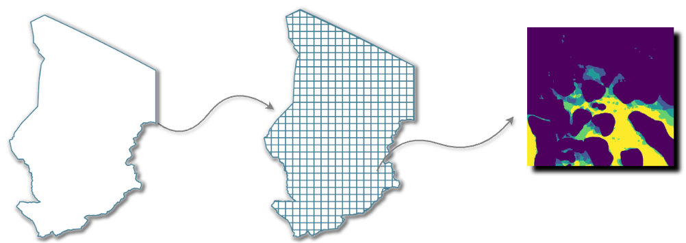

DEA Mosaic Builder
==================

Introduction
------------

Official documentation to setup and run the **DEA Mosaic builder**. `Github Home`_

The `DEA Analysis Sandbox`_ is a ``Jupyter Lab`` instance maintained and served by `Digital Earth Africa`_. A number of click-to-run jupyter notebooks are available in the ``sandbox`` that are capable of fetching a range of ``Sentinel-1`` satellite data for a single location. For this purpose the sanbox's memory and storage resources are more than sufficient. 

However, the ``sandbox`` memory and storage will fail if entire ``AMD0`` level data needs to be fetched and stored. The Mosaic Builder extends the capabilities of the **DEA Analysis Sandbox** in order to generate and store ``ADM0`` level data while working within the ``sandbox's`` memory and storage limitations.

.. _Github Home: https://github.com/rhinejoel/dea-mosaic-builder/tree/main
.. _DEA Analysis Sandbox: http://sandbox.digitalearth.africa
.. _Digital Earth Africa: https://www.digitalearthafrica.org 

.. toctree::
   :caption: Guides
   :hidden: 

   setup
   run

----

This documentation provides a **step-by-step guide** to setup and run each of these components and in-turn automate the entire process for any ``ADM0`` country in **Africa**.

----