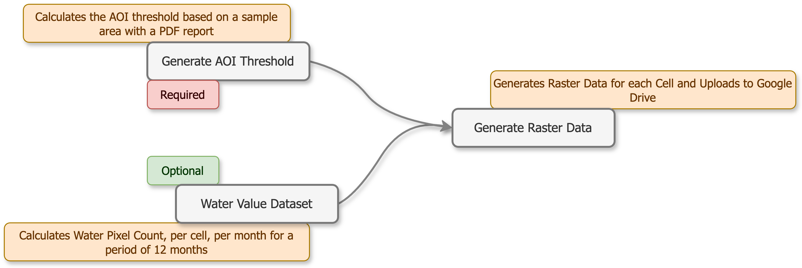

Run
===

.. toctree::
   :caption: Run
   :maxdepth: 3
   :hidden:

   run/threshold
   run/aoi
   run/flood

Run
---

And as of now, there are three notebooks to run the pipeline.

* **Generate AOI Thresholds** - ``1. aoi-threshold.ipynb`` Generates a threshold report based on a sample area covering land and water.
* **Calculate Dataset Water Values** - ``2. aoi-cell-count.ipynb`` Generates a table of count of ``wet pixels`` each month for a 12 month period.
* **Generate Raster Data** - ``3. gen-flood-raster.ipynb`` Generates the actual raster data and uploads it to **Google Drive** for the entire ``ADM0`` boundary.