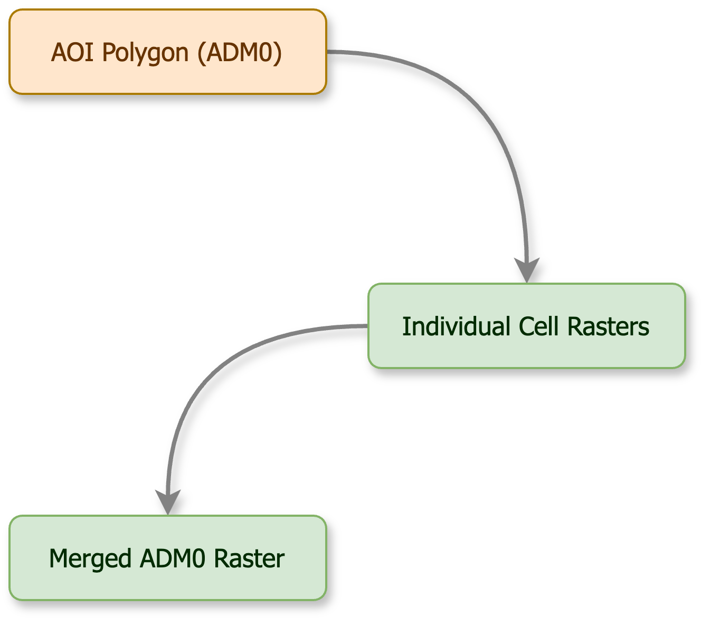
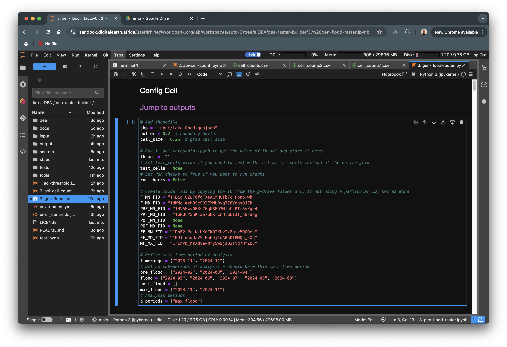
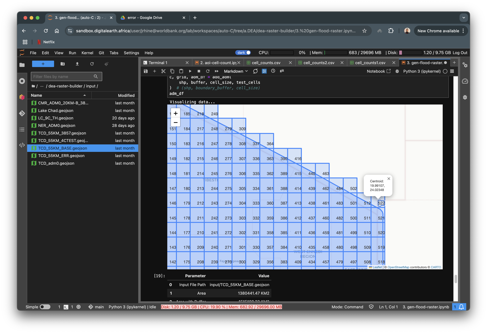
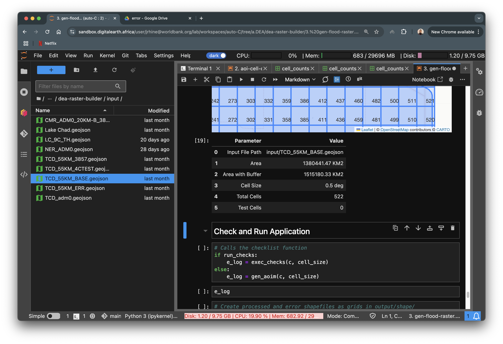
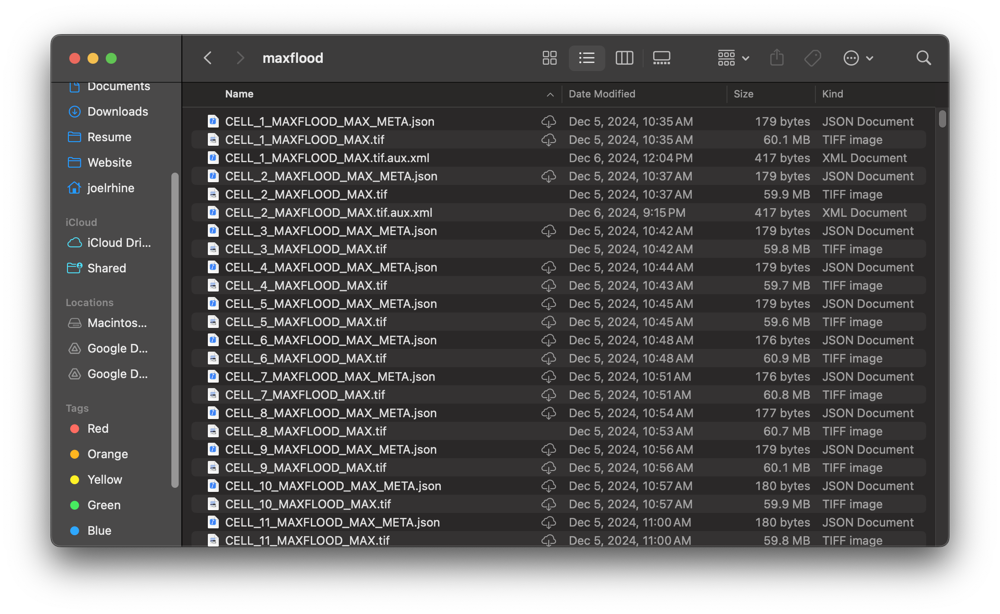

Generate Flood Raster
=====================

.. important:: This notebook takes round 10 - 16 hours to complete.

This notebook generates the actual radar water raster data for each cell and saved it to Google Drive using the `Drive API`_ via GCS. Once all the individual rasters have been generated and saved, they are accessed via `Drive Desktop`_ and merged in the local environment. 

.. _Drive API: https://developers.google.com/drive/api/guides/about-sdk
.. _Drive Desktop: https://support.google.com/drive/answer/10838124?hl=en

Prerequisites
-------------

AOI Vectorfile
^^^^^^^^^^^^^^

Upload an ``ADM0`` vector file in the input folder. The vector file may be in any CRS and must be as an ESRI shapefile or a ``GEOJSON`` file. For now we will export the file in CRS ``EPSG 4326`` and as a ``GEOJSON``.

.. important:: If directories have not been created, please first create the directories following instructions at `Create Required Directories`_

.. _Create Required Directories: genthreshold.html#create-required-directories

Config Cell
^^^^^^^^^^^
The ``Config Cell`` similar to the **Config Cell** in the previous docs, is the main cell where you will be able to configure the notebook at a higher level. All configurations are required, unless specified. However, this ``Config Cell`` has a bit more configurations.

.. warning:: Feel free to configure the main operational code as well, but keep in mind that notebook may not execte as required after edits. 

.. important:: The format to set ``test_cells`` for this notebook is different that the previous ones. Here ``test_cells`` is a list with two integers rather than just an integer. If ``test_cells = []`` which is an empty list, all the cells in the grid will be processed. The test cells can be set as ``test_cells = [start, end]``. On run, the process will execute from cell start (including the start cell) to cell end (excluding the end cell).

.. code:: Python

    # Add shapefile
    shp = "input/Lake Chad.geojson"
    buffer = 0.2  # boundary buffer
    cell_size = 0.09  # grid cell size

    # Run 1. aoi-threshold.ipynb to get the value of th_aoi and store it here.
    th_aoi = -24

    # test_cells = [3, 10] Process 7 cells from cell 3 (including cell 3) to cell 10 (excluding cell 10)
    test_cells = [] # Process all cells

    # Set run_checks to True if you want to run checks. Setting it to False will bypass checks and execute directly. 
    # Only set to False if data is verified.
    run_checks = True 

    # Create folder ids by copying the ID from the g-drive folder url. 
    # If not using a particular ID, set as None
    F_MN_FID = "1KBig_UZLT0fgFXsACMHQTb7c_Poao-wh"
    F_MD_FID = "1dWde-mzh8Sc9BIEMNUByq7Z6Yags0JZh"
    PRF_MN_FID = "1MVAMwv0E3sZ6qK8E93MlnGcPTr6yXge4"
    PRF_MD_FID = "1oROFY5hKi3w7pbkrCnHtGLIJT_nBraog"
    POF_MN_FID = None
    POF_MD_FID = None
    FE_MN_FID = "1RpE2-Pe-KihKdCk0TKLvTzZgrv5QGOeu"
    FE_MD_FID = "1KDTiwmmdaV5LBh6Dj1qAB5KTRNQu_-Xq"
    MF_MX_FID = "1rLnPb_hrXdve-mfy5wSjsU2TNd7HfZQu"

    # Define main time period of analysis
    timerange = ("2023-11", "2024-12")
    # Define sub-periods of analysis - should be within main time period
    pre_flood = []
    flood = ["2023-11", "2024-12"]
    post_flood = []
    max_flood = [] 
    # Analysis periods
    a_periods = ["flood"]
    # Required Analysis measurements
    a_measures = ["mean"]  # a_measures = ["mean", "median"]

The first few configurations remain the same. All configs that end with ``FID`` stand for ``Folder IDS``. They are all Google Drive Folder IDs as created in `Generate Thresholds Config Cell`_

The IDs are abbreviation of the type of folder. For example, 

``F_MN_FID`` - Flood Mean, 

``F_MD_FID`` - Flood Median,

``PRF_MN_FID`` - Preflood Mean,

``PRF_MD_FID`` - Preflood Median,

``POF_MN_FID`` - Postflood Mean,

``POF_MD_FID`` - Postflood Median,

``FE_MN_FID`` - Flood Extents Mean,

``FE_MD_FID`` - Flood Extents Median and 

``MF_MX_FID`` - Max Water

``timerange`` here as well, stands for the main time period of analysis, where as ``pre_flood``, ``flood`` and ``post_flood`` are sub-periods that are determined either by field knowledge or the generated ``CSV`` file from `AOI Counts`_.

.. note:: ``pre_flood``, ``flood`` and ``post_flood`` cannot exceed ``timerange``

Another config here is ``max_flood``. Its range is same as ``timerange`` since we need to find the maximum water extents per cell for within this time period.

The next configuration is ``a_periods``. This determines what analysis needs to be conducted. Here we see only ``flood`` exists in the list, thus, only ``flood`` data will be generated. Add or remove time periods as required.

.. code:: 

    a_period = ["max_flood", "pre_flood", "flood", "post_flood"]

The last configuration is ``a_measures``. This determines the statistical measurement to be calculated. Available measurements are ``median`` and ``mean``.

.. code:: 

    a_measures = ["mean"]  # a_measures = ["mean", "median"]

.. _Generate Thresholds Config Cell: genthreshold.html#config-cell
.. _AOI Counts: genaoicounts.html#water-count-csv

Execution
---------

.. image:: ../_static/th/th-5.png
    :align: center

Input Data Preview
^^^^^^^^^^^^^^^^^^

Once the Config Cell is set **Save**, click on ``Jump to Execution``. Click **Run** from the menu bar and click and **Run All Above Selected Cell** Run the next few cells incrementally by holding **SHIFT** and pressing **ENTER** 

The first in-line output similar to previous docs, is a map of the input file overlayed on a basemap. The numbers on the grid indicate the cells that will be processed. Here all the 522 cells will be processed.

.. note:: Clicking on the number gives information of the cell centroid coordinates.

The second in-line output as well, similar to previous docs, is information of the input vector file.

.. note:: While the notbook is processing, verify that data is being generated into Google Drive.

After that, the iteration over all executable cells will begin. On completion, if any errors have occured, they will be logged in ``e_log``. Sucessfull completion of the entire grid will result in a message that says 

.. code:: Python

    GRID PROCESSED AND UPLOADED SUCCESSFULLY

    Error Log json created and stored on disc    

Google Drive Desktop
^^^^^^^^^^^^^^^^^^^^

Open Google Drive Desktop and verify all the raster data that was generated from the notebook. 

.. note:: If you do not have Google Drive Desktop installed on your local computer, install it via `Drive Desktop`_ and login using your Google Project Account.

Open the ``test.ipynb`` notebook in the local environment you created using the `Local Environment`_ guide.

.. _Local Environment: setup/local.html#test-functions

.. note:: Run the cells again, just to make sure everything is working well. 

.. image:: ../_static/lc/lc-17.png
    :align: center

Virtual Raster and Tiff Output
^^^^^^^^^^^^^^^^^^^^^^^^^^^^

Once you have verified that everything is working well, create a ``.VRT`` raster file by adding the following code to your ``test.ipynb`` file.

.. code:: Python

    from tools.mosaic import CreateMosaic
    cm = CreateMosaic()

    root = "<path_to_gdrive_project_folder>/flood"
    dirs = None # dirs = ["flood", "pre_flood"] if multiple periods have been processed
    tifdir = "<path_to_local_project_folder>/raster"

    cm.tiles2tif(root, "ISO_A3_Code", tifdir=tifdir, indirs=dirs)

This will create a ``.TIF`` raster file at ``root`` with the name given under ``ISO_A3_Code``, which is a three letter `code <https://www.iban.com/country-codes>`_ for the country.

On running you should see the following output:

.. important:: This command takes quite some time to complete. Approximately 20 minutes per ``.VRT`` file.

.. code:: Python

    'merged' folder does not exist. Creating...
    Found 13975 Files. Merging in flood folder
    Creating NER_flood_merged.vrt
    Successfully creating .vrt, Converting to .tif...
    Creating NER_flood_merged.tif

.. important:: This command takes quite some time to complete (Anywhere between 50 mins and up depending on the size of the ``ADM0``)

Verify if the .TIF file has been created. If for some reason it is not created run the following command.

.. code:: 

    vrt_dir = "path_to_vrt_directory"
    cm.vrt2tif(vrt_dir, out_directory)

This should result in the following output

.. code:: 

    Generating...
    Converting ISO_A3_Code_merged_maxflood.vrt to ISO_A3_Code_merged_maxflood.tif

Once the process completes, the merged ADM0 raster is ready for analysis.