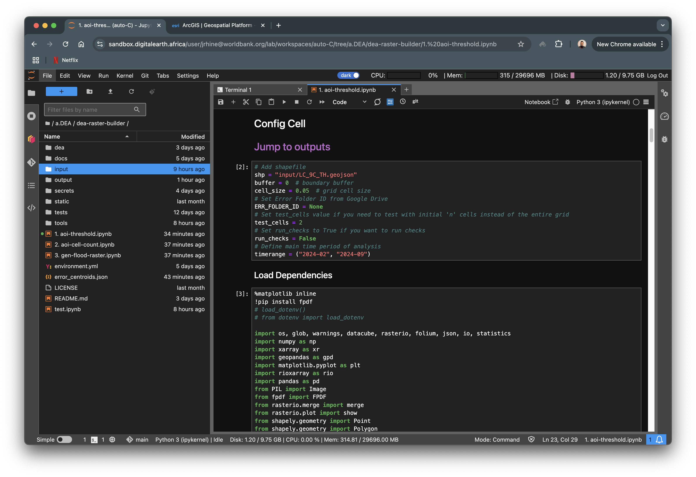

Generate AOI Counts
===================

This notebook gives an understanding of the actual **wet** pixels in all the cells of the ``ADM0`` grid as a ``CSV`` file. The input here is prepared or downloaded from a credible source which is converted into a grid. The **wet** or water pixels of each cell is calculated for each month in a 12-month period and stored in a ``CSV`` file also containing the cell-centroid coordinates, thus, enabling futher analysis.

Prerequisites
-------------

AOI Vectorfile
^^^^^^^^^^^^^^

Upload an ``ADM0`` vector file in the input folder. The vector file may be in any CRS and must be as an ESRI shapefile or a ``GEOJSON`` file. For now we will export the file in CRS ``EPSG 4326`` and as a ``GEOJSON``.

.. important:: If directories have not been created, please first create the directories following instructions at `Create Required Directories`_

.. _Create Required Directories: genthreshold.html#create-required-directories

Config Cell
^^^^^^^^^^^
The ``Config Cell`` similar to the Config Cell in the `Generate Threshold`_ docs, is the main cell where you will be able to configure the notebook at a higher level. All configurations are required, unless specified.

.. _Generate Threshold: genthreshold.html#config-cell

.. warning:: Feel free to configure the main operational code as well, but keep in mind that notebook may not execte as required after edits. 

.. code:: Python

    # Add shapefile
    shp = "input/<input_file_name>.geojson"
    buffer = 0  # boundary buffer
    cell_size = 0.5  # grid cell size

    threshold_aoi = -21

    # Set Error Folder ID from Google Drive
    ERR_FOLDER_ID = None
    # Set test_cells value if you need to test with initial 'n' cells instead of the entire grid
    test_cells = 2
    # Set run_checks to True if you want to run checks
    run_checks = False
    # Define main time period of analysis
    timerange = ("2023-11", "2024-11")

Change ``<input_file_name>`` to the name of your file. 

``buffer`` is the boundry buffer to be added. Keep this as ``0``.

``cell_size`` is the size of the grid cell in degrees. Even if the input file is in any other CRS it will be converted to ``EPSG:4326``. Leave this at ``0.05`` as well. 

Set ``test_cells`` to an ``integer n``  value if you would like to execute the first ``n`` cells. This is important to get an understanding of how the ouptput would look like.

.. code:: Python

    test_cells = 2 # process first 2 cells

The ``notebook`` also has a function in-place to conduct basic checks. This is set to ``False`` by deault, but you may set it to ``True`` to see what it looks like.

Finally, set the ``timerange`` of the analysis. In the sample code, the analysis is conducted between November 2023 to November 2024.

Outputs
-------
Input Data Preview
^^^^^^^^^^^^^^^^^^

If not automatically redirected to the outputs, use the ``Jump to outputs`` link under ``Config Cell``.

Once the Config Cell is set, **Save** and **Run All Cells** 

.. image:: ../_static/th/th-5.png
    :align: center

The in-line outputs are similar to the outputs for `Generate Thresholds`_.

.. _Generate Thresholds: genthreshold.html#input-data-preview

Sucessfull completion of the entire grid will result in a message that says 

.. code:: Python

    GRID PROCESSED AND UPLOADED SUCCESSFULLY

    Error Log json created and stored on disc   

Water Count CSV
^^^^^^^^^^^^^^^
A ``CSV`` file will be generated in **output/csv** after a successfull execution. The ``CSV`` help determine ``pre-flood``, ``flood`` and ``post-flood`` periods.  

