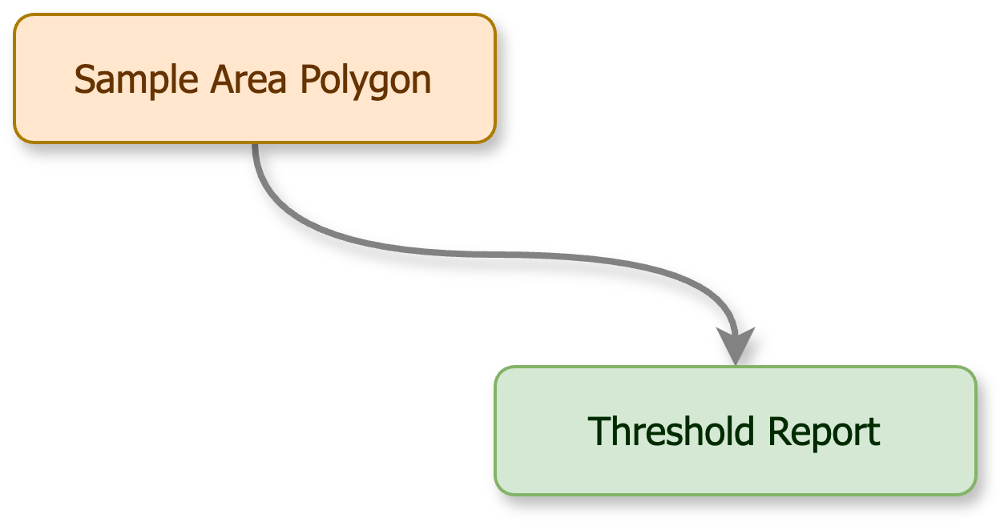
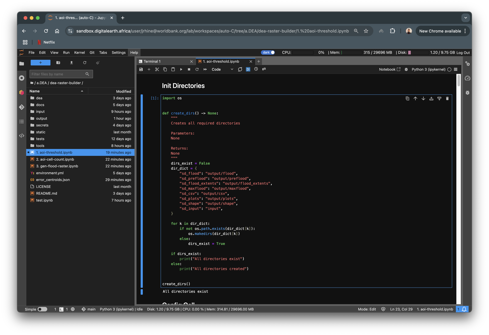
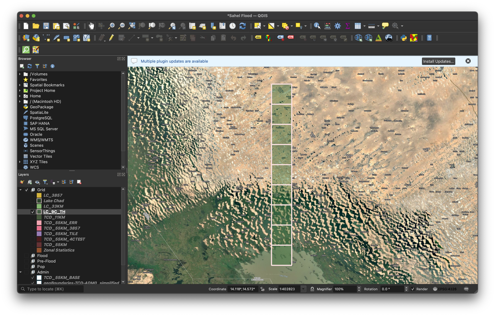
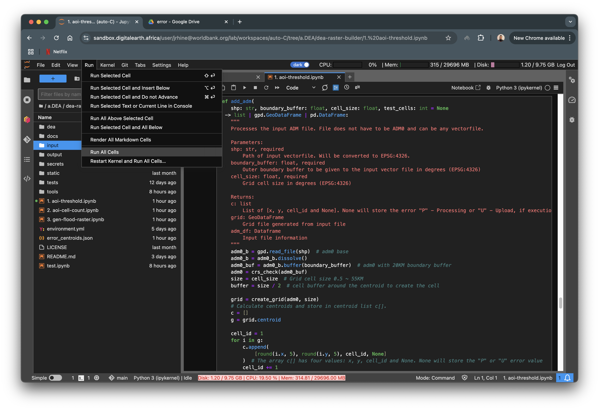
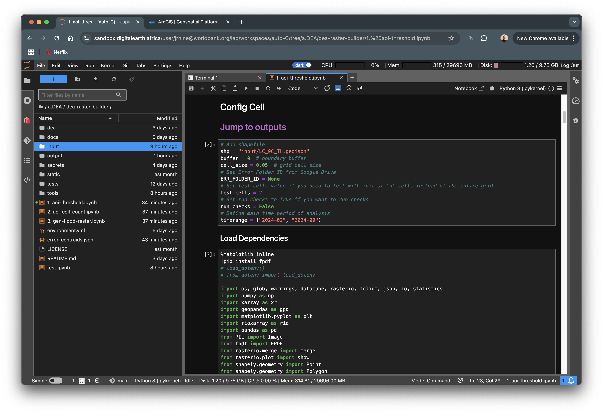
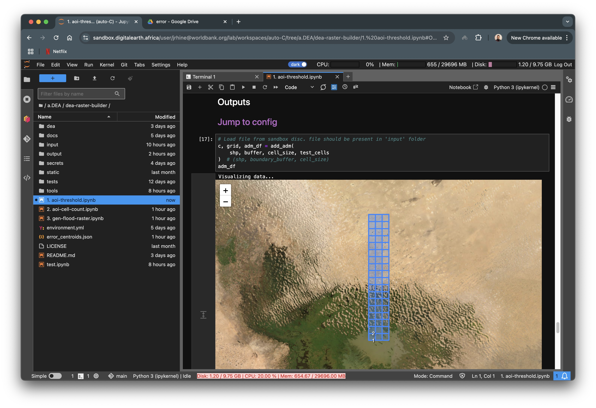
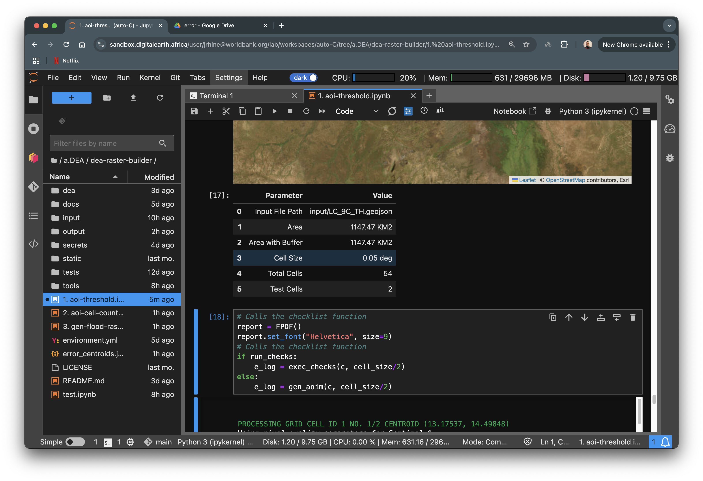
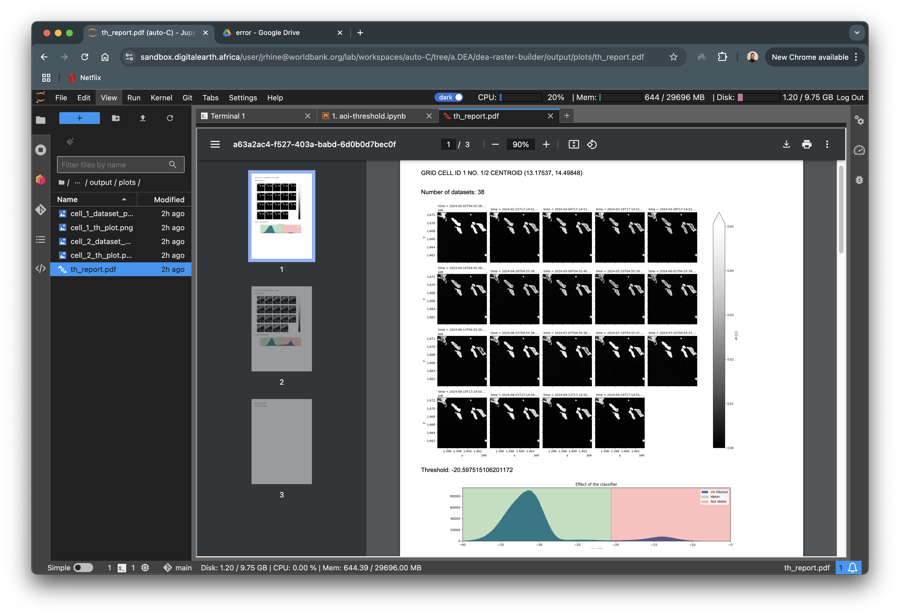

Generate Thresholds
===================

In order to run the subsequent notebooks we need to first identify a suitable threshold that can be applied to the entire AOI. To do this we use a sample grid with a small cell-size, that covers land and water and use it as an input to the first notebook ``01. aoi-threshold.ipynb``.

This is the threshold that identifies where land ends and where water begins. Additional information can be found here `Radar Water Detection with Sentinel-1`_. 

.. _Radar Water Detection with Sentinel-1: https://docs.digitalearthafrica.org/en/latest/sandbox/notebooks/Real_world_examples/Radar_water_detection.html

Prerequisites
-------------

Create Required Directories
^^^^^^^^^^^^^^^^^^^^^^^^^^^

First we will need to create the required directories. These directories will be used by all notebooks in this repository. To create the directories, simply run the ``[1]`` (first) code cell in the ``01. aoi-threshold.ipynb`` notebook. 

If you receive a message that says ``All directories created``, it means that all required folders have been generated, which should also be evident in the **File Browser Panel**.

Create Sample Data Cells
^^^^^^^^^^^^^^^^^^^^^^^^

Using `QGIS`_ or `ArcGIS`_ create an polygon that covers land and water and save it as a vector file. The vector file may be in any CRS and must be as an ESRI shapefile or a ``GEOJSON`` file. For now we will export the file in CRS ``EPSG 4326`` and as a ``GEOJSON``.

.. important:: Make sure that the polygon does not cover a very large area. An area of around 1000 Km2 is good.

.. note:: It does not have to be a grid like the image. A simple polygon will also work.

.. _QGIS: https://qgis.org/
.. _ArcGIS: https://www.esri.com/en-us/arcgis/geospatial-platform/overview

Upload the polygon ``GEOJSON`` file to the **input/** folder that was just created after running the first cell.

.. important:: If using ESRI shapefile (``*.shp``), make sure to upload all the auxillary files as well.

Config Cell
^^^^^^^^^^^
The ``Config Cell`` is the main cell where you will be able to configure the notebook at a higher level. All configurations are required, unless specified.

.. warning:: Feel free to configure the main operational code as well, but keep in mind that notebook may not execte as required after edits. 

.. code:: Python

    # Add shapefile
    shp = "input/<input_file_name>.geojson"
    buffer = 0  # boundary buffer
    cell_size = 0.05  # grid cell size
    # Set Error Folder ID from Google Drive
    ERR_FOLDER_ID = None
    # Set test_cells value if you need to test with initial 'n' cells instead of the entire grid
    test_cells = None
    # Set run_checks to True if you want to run checks
    run_checks = False
    # Define main time period of analysis
    timerange = ("2024-02", "2024-09")

Change ``<input_file_name>`` to the name of your file. 

``buffer`` is the boundry buffer to be added. Keep this as ``0``.

``cell_size`` is the size of the grid cell in degrees. Even if the input file is in any other CRS it will be converted to ``EPSG:4326``. Leave this at ``0.05`` as well. 

In your project Google Drive create a root project folder. Within that folder, create an error collection folder and name it **error**. Copy the ``FOLDER_ID`` which is in the red box as-is and paste it as the value for ``ERR_FOLDER_ID``.

.. code:: Python

    ERR_FOLDER_ID = "Alpha_Numeric_Symbolic_Value"

.. warning:: Make sure not to miss any value while copying or else the API will not be able to find the folder and the process will terminate.

Set ``test_cells`` to an ``integer n``  value if you would like to execute the first ``n`` cells. This is important to get an understanding of how the ouptput would look like.

.. code:: Python

    test_cells = 2 # process first 2 cells

The ``notebook`` also has a function in-place to conduct basic checks. This is set to ``False`` by deault, but you may set it to ``True`` to see what it looks like.

Finally, set the ``timerange`` of the analysis. In the sample code, the analysis is conducted between February and September of 2024.

Outputs
-------

Once the Config Cell is set, **Save** and **Run All Cells** 

Input Data Preview
^^^^^^^^^^^^^^^^^^

If not automatically redirected to the outputs, use the ``Jump to outputs`` link under ``Config Cell``.

The first in-line output is a map of the input file overlayed on a satellite basemap. The numbers on the grid indicate the cells that will be processed. Here there are only two numbers, which means ``test_cells = 2`` was set in the Config Cell. 

.. note:: Clicking on the number gives information of the cell centroid coordinates.

The second in-line output is information of the input vector file. Here we can see that the total number of cells in the grid is actually 54, but because ``test_cells = 2``, only the first two cells wil be processed.

After that, the iteration over all executable cells will begin. On completion, if any errors have occured, they will be logged in ``e_log``. Sucessfull completion of the entire grid will result in a message that says 

.. code:: Python

    GRID PROCESSED AND UPLOADED SUCCESSFULLY

    Error Log json created and stored on disc     

Threshold Report
^^^^^^^^^^^^^^^^

A report will be genrated and stored in **output/plots/th_report.pdf**. This report has information about the datasets, water classifier plots and thresholds for each executed cell.

The end of the report has the Mean as well as the Meadian Thresholds for all executed cells. Based on your project's requirement and the report, select the appropriate value. 

.. important:: Store this value because it will be used in subsequent notebooks as the value for ``threshold_aoi``