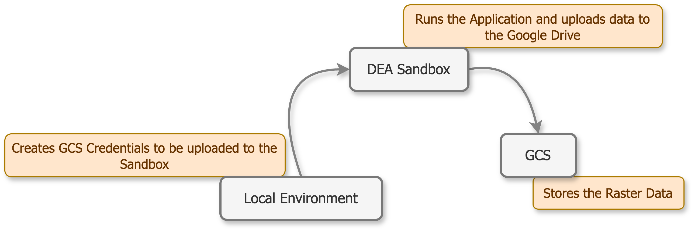

Setup
=====

.. toctree::
   :caption: Setup
   :maxdepth: 3
   :hidden:

   setup/gcs
   setup/local
   setup/sandbox

Setup
-----

The first part of this documentation deals with all the necessary steps required to set this automated pipeline up and the second part gives an understanding of how to run the pipeline.

There are three main components to setup the **Mosaic Builder**:

* **Google Drive API** via ``GCS`` to store the data.
* **Local Processing** to generate ``GCS`` ``credentials`` and merge the files.
* **DEA Analysis Sandbox** to run the application.

Each component requires setup and is covered in this documentation in detail.