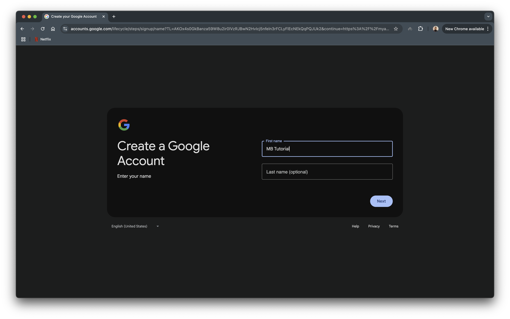
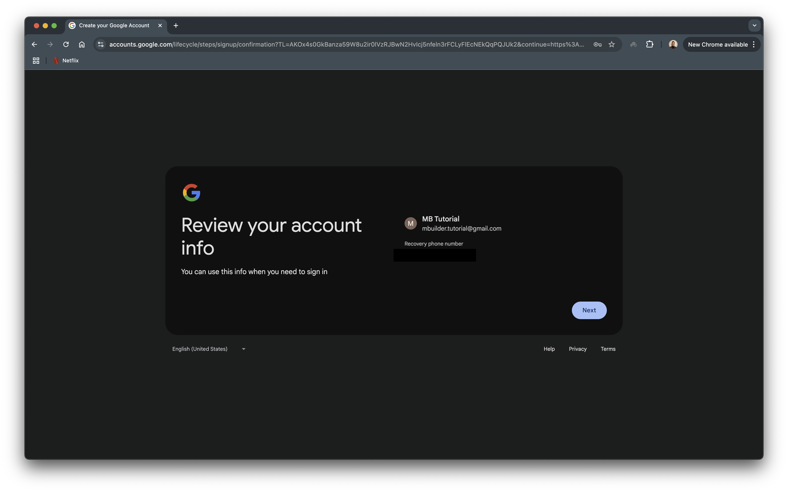
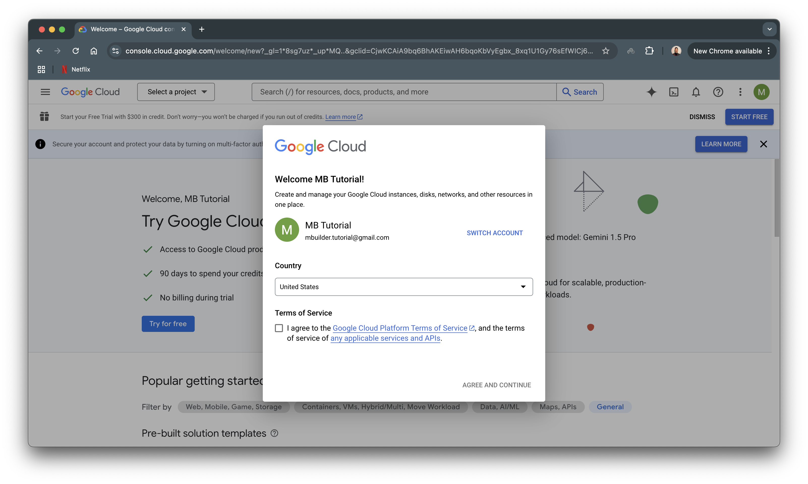
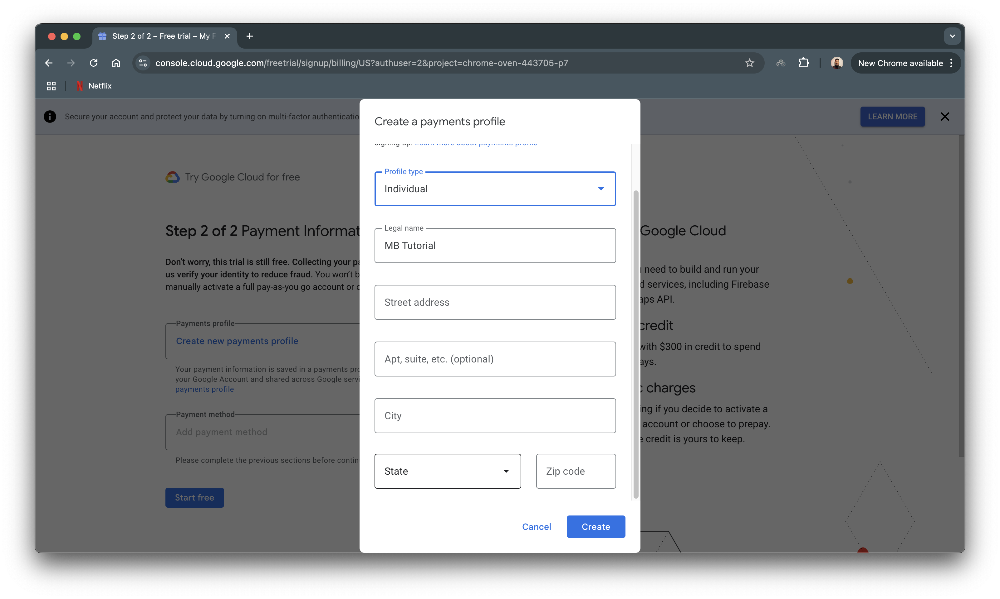
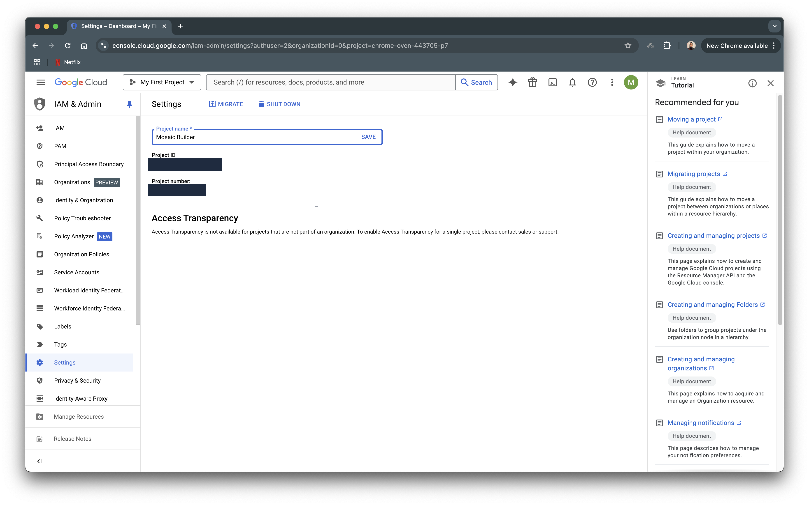
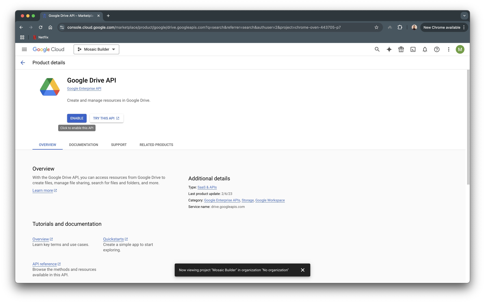

Google Cloud Services Integration
=================================

The way that the Mosaic Builder overcomes the disc storage limitations of the DEA Sandbox is by storing data into Google Drive using the Google Drive API via GCS. This is only required if you intend to generate data for the entire ADM0 AOI. As for smaller areas, the sandbox's disc storage is sufficient. In this page we will setup the GCS services that we require to integrate with the sandbox.

Create Google Account
---------------------

To begin create a new Personal Google Account and give it whatever name you like. 

Select an (available) email address and hit next. Your new Google Account should now be setup.

Create GCS Project
------------------

Now head on to the `Google Cloud Console`_. Select the correct (new) project account if not already selected. Accept the terms and condiions and hit "Agree and Continue"

.. important:: Google Cloud Services requires a payment method to be on file even though we will only use free services. For the purposes of this tutorial, no GCS charges will be incurred.

Click on "Try for free". Agree to terms and conditions and create a Payments Profile. Add information and click "Create". Add a credit or debit card ans hit "Start free".

.. image:: ../_static/gcs-3.png
    :align: center

On GCS Home, you should see "My First Project". Go to `Project Settings`_ or click on the three dots near the profile picture (on the right) and select "Project Settings". Change the name to your project name and click "Save".

Enable Google Drive API
-----------------------

Type "drive" in the search bar and click on Google Drive API. Click "Enable".

Google Drive Account
--------------------

.. note:: Confirm that you are on the new project's Googlr Drive account and not your personal. If it is your personal account, switch it to the project account by clicking on the profile picture and selecting the correct account.

In your `project's drive`_, select Storage. Select "Get More Storage" and select the storage that you would require for your project.

.. note:: Around 185 GB of data was generated for ADM0 Chad

.. _Google Cloud Console: https://console.cloud.google.com
.. _Project Settings: https://console.cloud.google.com/iam-admin/settings
.. _project's drive: https://drive.google.com/
