Local Environment
=================

We need to replicate the Sandbox envireonment locally for two reasons - to generate the GCS credentials which will be used in the sandbox and to create a merged .vrt (virtual) raster file. Create a new project directory and open VS code in that directory. 

.. note:: You are free to use whatever IDE you like. For the purposes of this guide, we will use VS Code. If you do not have VS Code installed, download and install it from `VS Code`_.

.. _VS Code: https://code.visualstudio.com

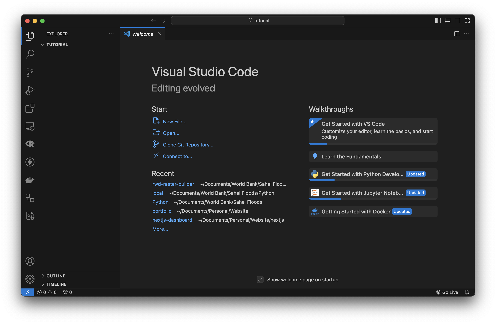

Clone Repository
----------------

Open VS Code terminal and run

.. code::

    git clone https://github.com/rhinejoel/dea-mosaic-builder.git

    cd dea-mosaic-builder

Your VS code Explorer should look like this

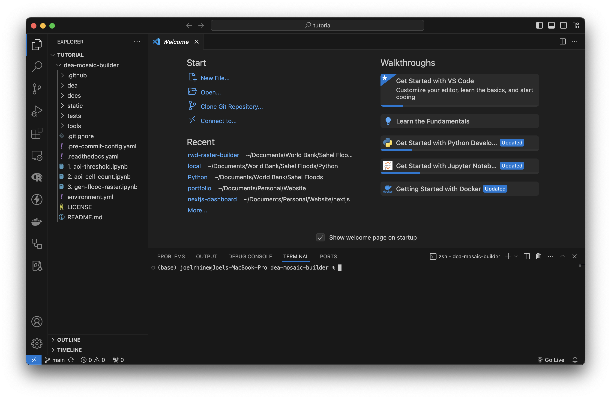

Micromamba 
----------

Create Environment
^^^^^^^^^^^^^^^^^^

Micromama is a faster version of conda. If you do not have micromamba installed install it from `Micromamba's Installation Docs`_

.. _Micromamba's Installation Docs: https://mamba.readthedocs.io/en/latest/installation/micromamba-installation.html

.. note:: It is recommended to use micromamba. conda/miniconda will still work, but substantially slowly as compared to micromamba. Just switch the command from micromamba to conda to use conda.

From the current folder run

.. important:: Ensure that you are in the dea-mosaic-builder folder or else micromamba/conda will not be able to find the environment.yml file.

.. code:: 

    micromamba create -f environment.yml -y

    micromamba activate dea-env

This will create a new micromamba environment with the name "dea-env". The second command activats the "dea-env" environment.

.. code:: 

    python -m ipykernel install --user --name=dea-env

This will add the newly created "dea-env" as a kernel for Jupyter Notebooks which we will need later

Test Environment 
^^^^^^^^^^^^^^^^

.. important:: Ensure that the newly created environment is activated. If it is you should see the name of the environment instead of (base).

Run the deps.py file to test if all dependencies are imported successfully. You should get a message that says "Dependencies Import Successful".

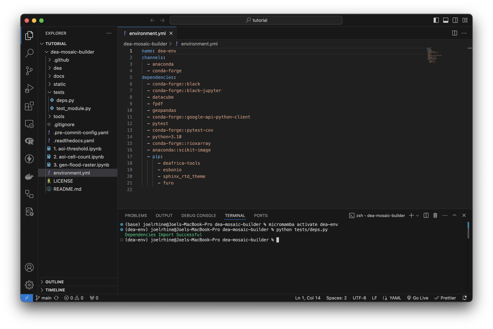

Get Google Drive Creds
----------------------

Configure the OAuth Consent Screen
^^^^^^^^^^^^^^^^^^^^^^^^^^^^^^^^^^

In the Google Cloud console, go to Menu > APIs & Services > `OAuth consent screen`_.

.. _OAuth consent screen: https://console.cloud.google.com/apis/credentials/consent

.. important:: Ensure that you are in the Project's Google Account and not Personal and that your project is selected in the GCS's project drop down.

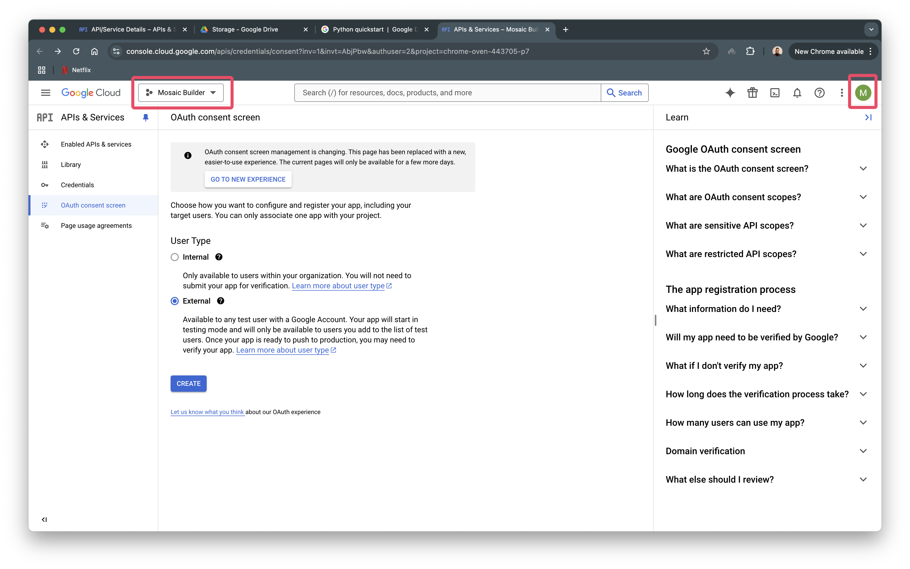

For "User type" select "External", then click "Create".

Add an appropriate name for "App Name" and select the project email address in "User support email". Add your personal email in "Developer contact information" and hit "Save and Continue"

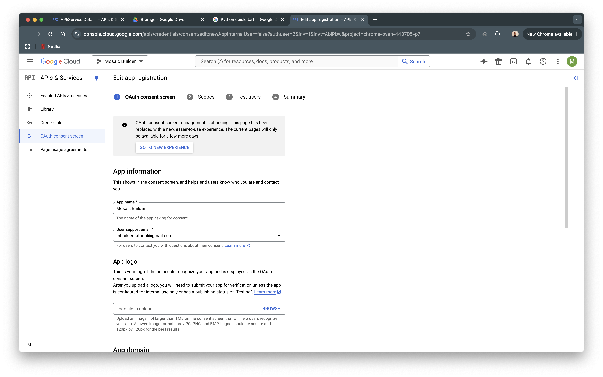

For now, you can skip adding scopes and click "Save and Continue".

Add your project email address as a "Test User" and click "Save and Continue". 

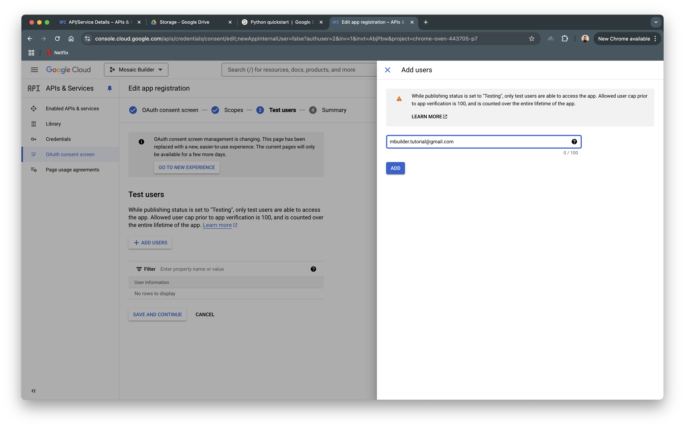

Review your app registration summary. To make changes, click "Edit". If the app registration looks OK, click "Back to Dashboard". On your dashboard, click "Publish App" under "Publishing status" and click "Confirm" to the "Push to production" dialog.

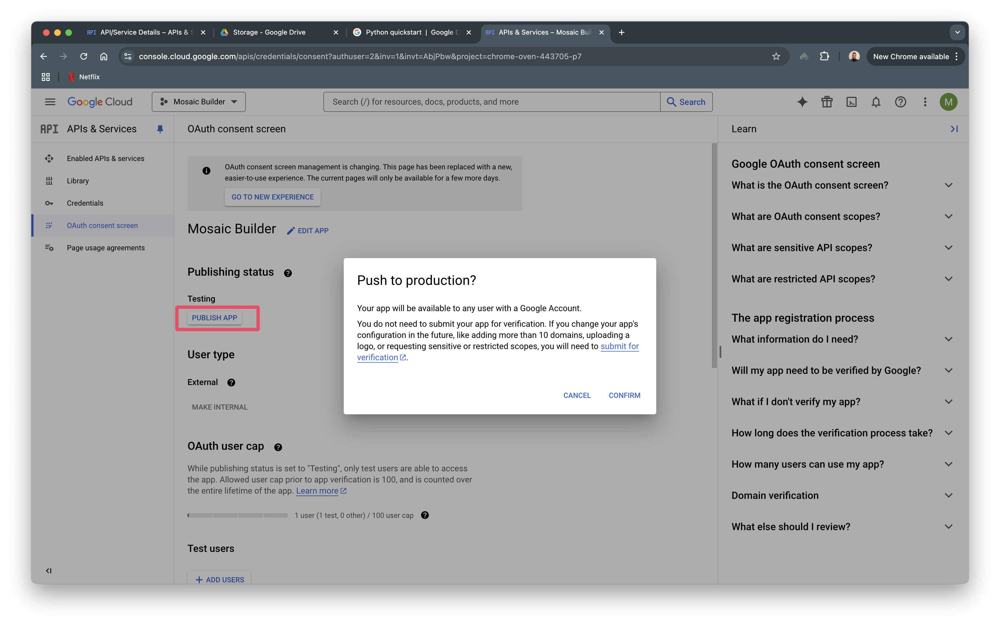

.. note:: The app is pushed to production in order to avoid giving access to the test users every 10 days which would happen if it was still under "Testing" status.

.. important:: We have created a desktop app with the name specified under "App Name". The reason we created a desktop app and not a service acount is that a Google service account acts as an intermediary between the user account and the Google Drive. It has a limit of 15GB, which cannot be changed and deleting data from the Google drive does not reflect in the service account. So if the service account's 15 GB gets filled, the application will then terminate due to lack of storage even if there is more than 15 GB in the Google Drive storage. 

Authorize Credentials for the Desktop Application
^^^^^^^^^^^^^^^^^^^^^^^^^^^^^^^^^^^^^^^^^^^^^^^^^
In the Google Cloud console, go to Menu > APIs & Services > `Credentials`_

.. _Credentials: https://console.cloud.google.com/apis/credentials

.. important:: Ensure that you are in the Project's Google Account and not Personal and that your project is selected in the GCS's project drop down.

Click Create Credentials > OAuth client ID. 

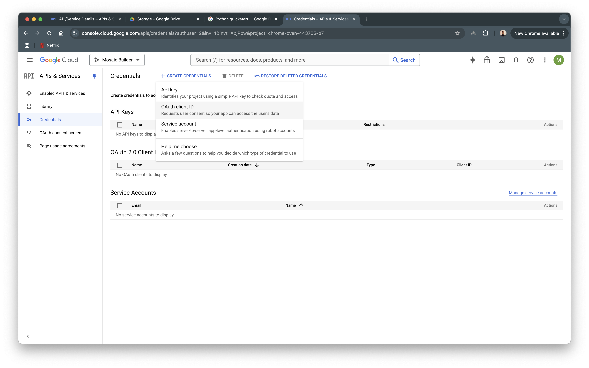

Click Application type > Desktop app. Give a name to the OAuth client and click "Create"

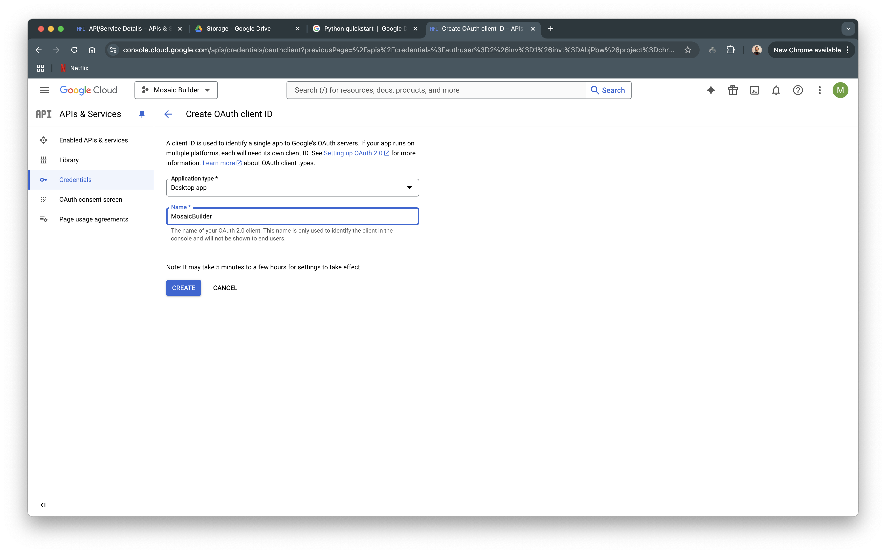

Click on "Download JSON" and save the downloaded file as "u_credentials.json".

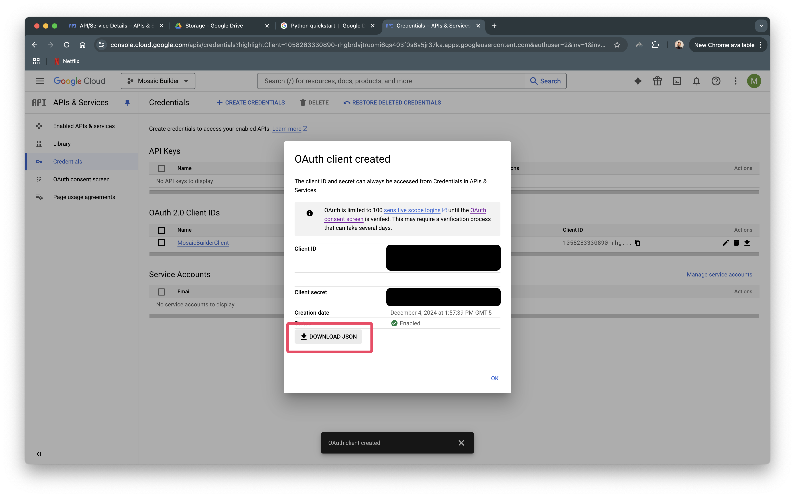

Generate Token
^^^^^^^^^^^^^^

In the root folder (dea-mosaic-builder) create a new folder named "secrets". Move the "u_credentials.json" file to the secrets folder.

.. note:: Notice that the secrets folder is greyed out. This is because it is inclueded in .gitignore to ensure that it is not tracked by git and pushed to Github by mistake. If it is not greyed out, check the spelling and case of the folder. 

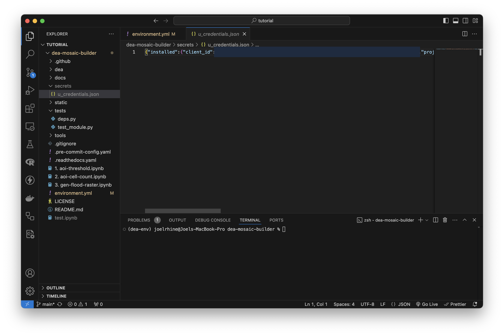

In the root folder (dea-mosaic-builder) create a new Jupyter Notebook file called "test.ipynb". 

.. note:: This file is also included in .gitignore and not tracked by git.

Click on "Select Kernel" on the top right and select "dea-env" from "Python Environments". Add the two lines of code in the first cell and run the cell by hitting Shift ⇧ + Enter ↵ .

.. important:: This code has to be executed locally. If this code is exucuted on a server like Jupyter Lab or Google Collab it will fail.

.. code:: Python

    from tools.gdrive import GDrive
    gd = GDrive()

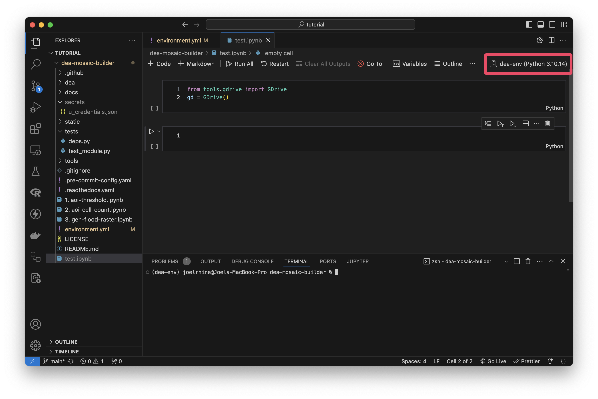

Executing this will open the default browser's window and ask to choose a Google Account. Click on the project's email account address. 

.. note:: If you do not see the project's Google Account, click "Use another account" and add the project account.

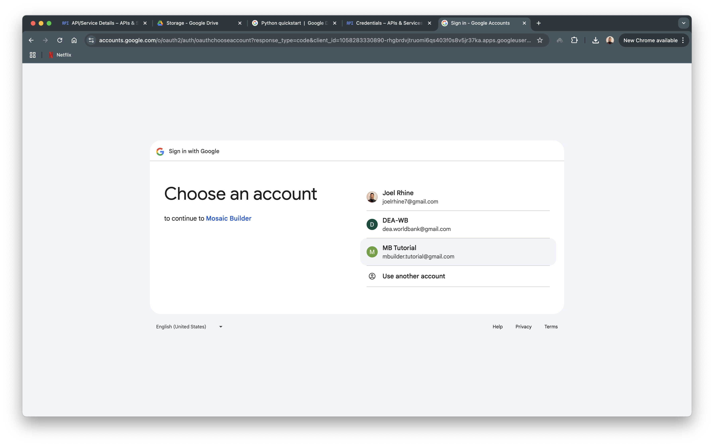

.. important:: Click on "Show Advanced" and click "Proceed to Mosaic Builder", if it appears.

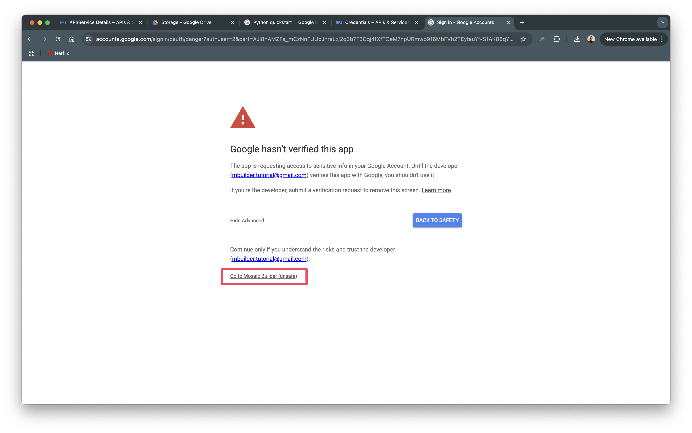

Click "Continue". 

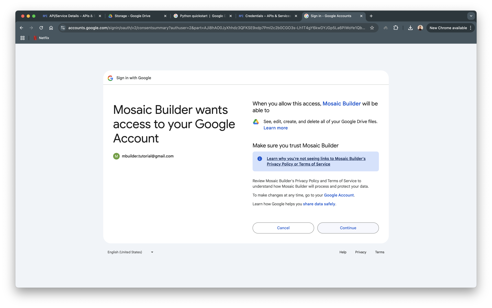

If the process is executed successfully you should see the following message in the browser window. Additionally you will also find a new file "token.json" generated in the "secrets" folder. If this file has been generated, all steps have been completed successfully.

.. code::
    
    The authentication flow has completed. You may close this window.

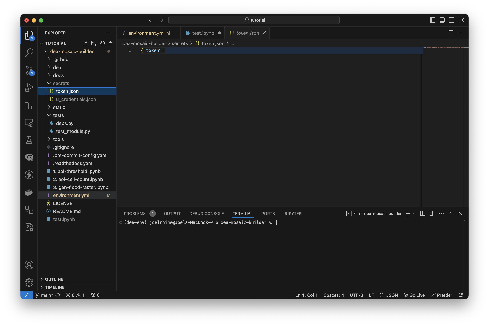

Test Functions
^^^^^^^^^^^^^^

In the next cell add the following code and run.

.. code:: Python

    gd.get_storage()

the get_storage() function fetched the available storage from the project's Google Drive. If the output of the cell looks like the following, it means that Google Drive has been successfully integrated.

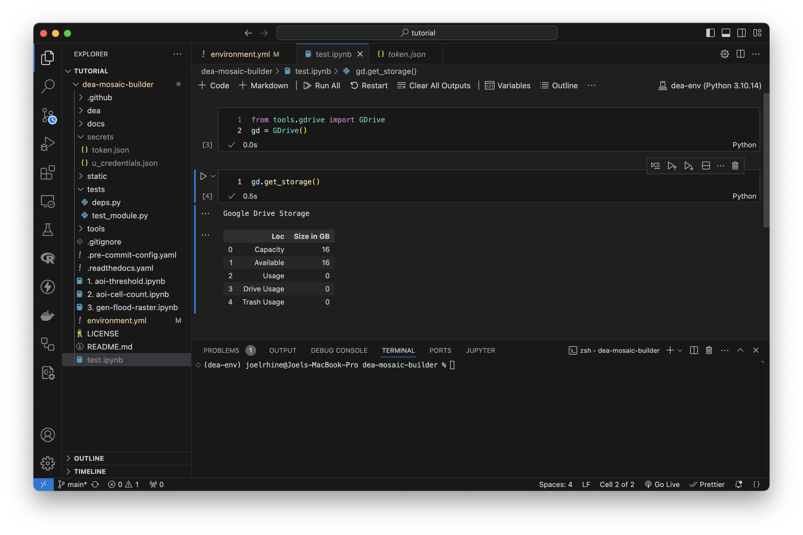

