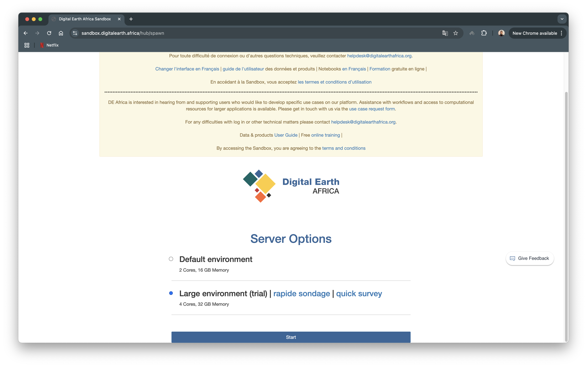

DEA Sandbox
===========

The DEA Analysis Sandbox runs on the DEA server, which is an AWS EC2 instance. In order to access the Sandbox, create an account by following the instructions on the `Getting Started Page`_

.. _Getting Started Page: https://docs.digitalearthafrica.org/en/latest/sandbox/access.html

Navigate to the `Login`_ page, once the account has been created.

.. _Login: https://sandbox.digitalearth.africa/hub/login

After logging in, choose the default environment with 2 Cores and 16 GB RAM. Hit "Start" and the server should begin starting up.

.. note:: If for some reason this environment is slow, a later switch to the large environment is possible as well, without any loss of data

Clone Repository
----------------

Create a new folder called "a.DEA". This will make sure that your folder will remain at the top of the directory. However, this is only a personal preference. You can name it whatever you like.

Close all the Jupyter Notebooks which will bring up the "Launcher". Open the "a.DEA" foler and click on "Terminal". This will open the terminal in the "a.DEA" directory.

.. image:: ../_static/sandbox/sb-2.png 
    :align: center

In the terminal clone the repository by running

.. code:: 

    git clone https://github.com/rhinejoel/dea-mosaic-builder.git

    cd dea-mosaic-builder

Your directory should now have a new folder "dea-mosaic-builder". The second command moves the terminal within the "dea-mosaic-builder" folder

Upload Creds
------------

We now need to create the "secrets" folder which has two files - "u_credentials.json" and "token.json" into the sandbox's "dea-mosaic-builder" directory. To do this, create a new folder called "secrets" and upload the two files into the folder.

Your working directory should look like this

Test Run
--------

Double click on the "3. gen-flood-raster.ipynb" Jupyter Notebook and run the first two cells by hitting Shift ⇧ + Enter ↵ .

.. note:: Notice that the second cell has the same code we used to test GCS integration locally

If both cells execute without any errors, the mosaic builder setup is now complete and ready to run.

.. hint:: The cell has executed successfully if there is a number [2] next to the cell instead of an asterisk [*]

